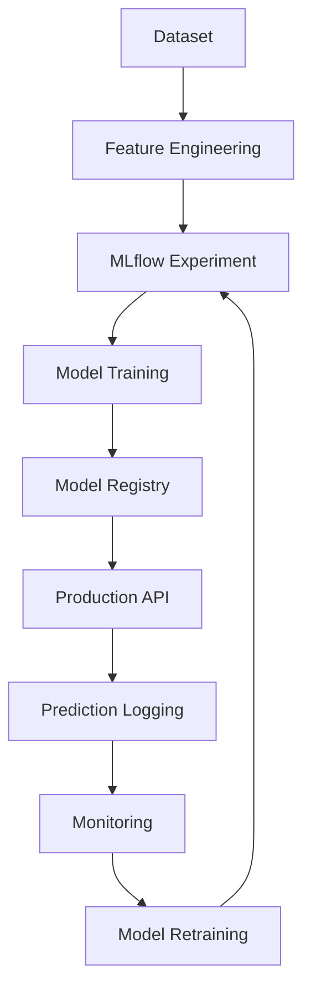

# Decision Recruitment AI

Sistema de Inteligência Artificial para predição de match candidato-vaga usando XGBoost, desenvolvido para a Decision.

## Visão Geral

O **Decision Recruitment AI** é uma solução completa de Machine Learning que utiliza algoritmos de classificação para prever a probabilidade de contratação de candidatos, otimizando o processo de recrutamento da Decision.

### Objetivos

- **Automatizar** o processo de triagem inicial de candidatos
- **Otimizar** o match entre candidatos e vagas
- **Reduzir** o tempo de recrutamento
- **Aumentar** a precisão na seleção de candidatos
- **Fornecer** insights baseados em dados históricos

## Arquitetura

```

Dados JSON Feature Eng. Modelo XGBoost 
(Jobs, Props, & Preproc. Treinamento 
Applicants) 

Monitoramento API FastAPI Modelo Salvo 
& Logs /predict (Pickle) 

```

## Dados

### Estrutura dos Dados

- **vagas.json**: 14.081 vagas com informações detalhadas
- **prospects.json**: 14.222 prospecções de candidatos
- **applicants.json**: 42.482 candidatos com perfis completos

### Dataset Unificado

- **53.759 registros** de candidatos-vagas
- **Taxa de contratação**: 5,5% (2.984 candidatos contratados)
- **57 features** extraídas e preparadas

## Features do Modelo

### Features de Compatibilidade
- Match de nível profissional
- Compatibilidade de idiomas (inglês/espanhol)
- Alinhamento de formação acadêmica

### Features de Análise de Texto
- Presença de palavras-chave técnicas no CV
- Certificações mencionadas
- Comprimento e qualidade do CV

### Features Temporais
- Tempo de resposta à vaga
- Categorização temporal

### Features de Engagement
- Qualidade dos comentários
- Presença de informações de remuneração
- Detalhamento das candidaturas

## Instalação e Uso

### 1. Clone o Repositório

```bash
git clone <repository-url>
cd fiap-final
```

### 2. Instalar Dependências

```bash
pip install -r requirements.txt
```

### 3. Treinar o Modelo

```bash
python model_pipeline.py
```

### 4. Executar API Localmente

```bash
python fastapi_app.py
```

### 5. Deploy com Docker

```bash
python deploy.py
```

## API Endpoints

### Base URL
```
http://localhost:8000
```

### Endpoints Disponíveis

#### 1. Health Check
```http
GET /health
```

#### 2. Predição Única
```http
POST /predict
Content-Type: application/json

{
"candidate": {
"nome": "João Silva",
"nivel_profissional_candidato": "Sênior",
"nivel_ingles_candidato": "Avançado",
"nivel_espanhol_candidato": "Intermediário",
"cv_text": "Desenvolvedor Python com 5 anos de experiência...",
"pcd": "Não",
"remuneracao": 8000.0,
"estado": "São Paulo"
},
"job": {
"titulo_vaga": "Desenvolvedor Python Sênior",
"nivel_profissional_vaga": "Sênior",
"nivel_ingles_vaga": "Avançado",
"nivel_espanhol_vaga": "Básico",
"vaga_sap": "Não",
"competencia_tecnicas": "Python, Django, Flask, AWS, Docker",
"cliente": "TechCorp",
"tipo_contratacao": "CLT Full"
}
}
```

#### 3. Predição em Lote
```http
POST /predict_batch
Content-Type: application/json

{
"candidates": [...],
"job": {...}
}
```

#### 4. Informações do Modelo
```http
GET /model_info
```

#### 5. Importância das Features
```http
GET /feature_importance
```

### Resposta da API

```json
{
"prediction": 1,
"probability": 0.85,
"confidence": "High",
"recommendation": "RECOMENDADO",
"explanation": "Candidato tem alta compatibilidade com a vaga",
"timestamp": "2025-09-12T20:30:00",
"status": "success"
}
```

## Testes

### Testes da API
```bash
python test_api.py
```

### Testes Unitários
```bash
python test_unit.py
```

### Monitoramento
```bash
python monitoring.py
```

## Performance do Modelo

### Métricas de Treinamento
- **AUC Score**: 0.8701
- **CV AUC Score**: 0.8368 (±0.0729)
- **Precision**: 0.74 (classe positiva)
- **Recall**: 0.28 (classe positiva)
- **F1-Score**: 0.41 (classe positiva)

### Features Mais Importantes
1. `global_compatibility_score`
2. `nivel_profissional_compatibility`
3. `technical_fit_score`
4. `nivel_ingles_compatibility`
5. `cv_has_technical_keywords`

## Docker

### Construir Imagem
```bash
docker build -t decision-recruitment-ai:latest .
```

### Executar Container
```bash
docker run -d --name decision-recruitment-api -p 8000:8000 decision-recruitment-ai:latest
```

### Verificar Status
```bash
docker ps --filter name=decision-recruitment-api
```

### Ver Logs
```bash
docker logs decision-recruitment-api
```

## Monitoramento

### Logs de Predições
- Localização: `logs/predictions.log`
- Formato: JSON estruturado
- Inclui: timestamp, predição, probabilidade, tempo de resposta

### Métricas
- Localização: `logs/metrics.json`
- Período: Últimas 24 horas
- Inclui: taxa de recomendação, confiança, tempo de resposta

### Detecção de Drift
- Comparação com baseline
- Alertas automáticos
- Threshold configurável

## Documentação da API

Acesse a documentação interativa em:
- **Swagger UI**: http://localhost:8000/docs
- **ReDoc**: http://localhost:8000/redoc

## Estrutura do Projeto

```
fiap-final/
README.md # Este arquivo
requirements.txt # Dependências Python (inclui MLflow)
Dockerfile # Configuração Docker
.dockerignore # Arquivos ignorados no Docker
model_pipeline.py # Pipeline de treinamento (com MLflow)
fastapi_app.py # API FastAPI (com MLflow logging)
test_api.py # Testes da API
test_unit.py # Testes unitários
monitoring.py # Sistema de monitoramento (com MLflow)
deploy.py # Script de deploy
data_analysis.py # Análise inicial dos dados
mlflow_config.py # Configuração MLflow
mlflow_experiments.py # Scripts de experimentos MLflow
start_mlflow.py # Inicializador MLflow UI
models/ # Modelos treinados
xgboost_model.pkl
label_encoders.pkl
scaler.pkl
model_metadata.json
mlruns/ # MLflow tracking data
0/ # Experimento padrão
[experiment_id]/ # Experimentos específicos
logs/ # Logs do sistema
predictions.log
metrics.json
dataset_preparado.csv # Dataset processado
```

## Casos de Uso

### 1. Triagem Automática
- Classificar candidatos automaticamente
- Priorizar candidatos com maior probabilidade
- Reduzir tempo de análise manual

### 2. Análise de Compatibilidade
- Avaliar match técnico
- Verificar alinhamento cultural
- Identificar gaps de competências

### 3. Insights de Recrutamento
- Identificar padrões de sucesso
- Otimizar descrições de vagas
- Melhorar processo de seleção

## MLflow Integration

O projeto agora inclui integração completa com MLflow para experimentação, tracking e versionamento de modelos.

### Iniciando MLflow

```bash
# Iniciar MLflow UI
python start_mlflow.py

# Ou manualmente
mlflow ui --backend-store-uri file:./mlruns
# Acesse: http://localhost:5000
```

### Funcionalidades MLflow

#### 1. **Experiment Tracking**
- Rastreamento automático de parâmetros e métricas
- Comparação de diferentes configurações de modelo
- Visualização de resultados em tempo real

#### 2. **Model Registry**
- Versionamento automático de modelos
- Gestão de stages (Staging, Production, Archived)
- Deploy automático do melhor modelo

#### 3. **Experimentos Automatizados**
```bash
# Executar suite completa de experimentos
python mlflow_experiments.py

# Treinar modelo com MLflow tracking
python model_pipeline.py
```

#### 4. **API Integration**
- Logging automático de predições em produção
- Métricas de performance em tempo real
- Endpoint `/mlflow_info` para informações do MLflow

#### 5. **Monitoramento Avançado**
```bash
# Monitorar sistema completo (incluindo MLflow)
python monitoring.py
```

### Experimentos Disponíveis

1. **Hyperparameter Tuning**: Testa diferentes configurações do XGBoost
2. **Model Comparison**: Compara XGBoost, Random Forest e Logistic Regression
3. **Feature Analysis**: Analisa importância das features
4. **Production Logging**: Registra predições em tempo real

### Workflow MLflow



## Próximos Passos

### Melhorias Planejadas
- [x] **MLflow Integration** - Experiment tracking e model registry
- [ ] Integração com ATS existente
- [ ] Interface web para usuários
- [ ] Modelo de recomendação de vagas
- [ ] Análise de sentimento em CVs
- [ ] Dashboard de métricas em tempo real

### Expansões
- [ ] Suporte a mais tipos de vaga
- [ ] Integração com LinkedIn API
- [ ] Modelo de retenção de funcionários
- [ ] Sistema de feedback contínuo
- [ ] MLflow Model Serving
- [ ] A/B Testing de modelos

## Contribuição

1. Fork o projeto
2. Crie uma branch para sua feature
3. Commit suas mudanças
4. Push para a branch
5. Abra um Pull Request

## Licença

Este projeto está sob a licença MIT. Veja o arquivo `LICENSE` para mais detalhes.

## Equipe

- **Desenvolvedor**: [Seu Nome]
- **Instituição**: FIAP

## Suporte

Para dúvidas ou suporte:
- Email: [seu-email@exemplo.com]
- LinkedIn: [seu-linkedin]
- GitHub: [seu-github]

---

**Decision Recruitment AI** - Transformando recrutamento com Inteligência Artificial 
